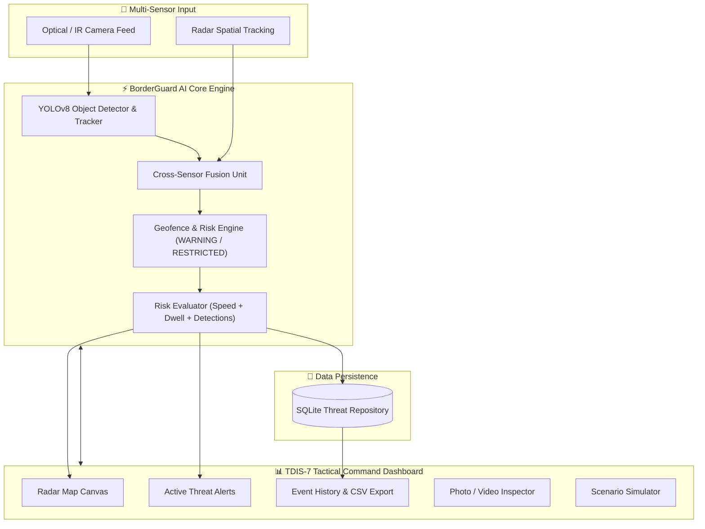

# 🛡️ BorderGuard AI — Tactical Defense Intelligence System (TDIS-7)


**BorderGuard AI** is a state-of-the-art, multi-sensor surveillance and threat assessment platform designed for perimeter security, border defense, and critical infrastructure monitoring. Powered by **YOLOv8 deep learning**, cross-sensor detection fusion, dynamic geofenced risk evaluation, and an interactive **TDIS-7 Tactical Command Center UI**.

---

## 📸 System Interface (TDIS-7 Cyber Defense Theme)

The system features a custom high-tech military surveillance dashboard rendered in a high-contrast dark green/cyan radar grid theme with real-time telemetry updates.

- **Interactive Border Sector Radar Canvas**: Real-time target trajectories, camera field-of-view (FOV) cones, and dynamic warning/restricted zone boundaries.
- **Real-Time Telemetry & Threat Matrix**: Dwell time, intruder speed, directional vectoring, and dynamic risk scoring (`CRITICAL`, `WARNING`, `SAFE`).
- **Live Event Log & Alert History**: Instant notification stream with filterable alert history and CSV telemetry export.

---

## 🔥 Key Features

- 🎯 **YOLOv8 Computer Vision Pipeline**: Detects and tracks intruders (person, vehicle, drone/animal) in optical and thermal camera feeds with bounding boxes, confidence scores, and centroid estimation.
- 📡 **Cross-Sensor Fusion Engine**: Merges camera object detections with simulated radar/infrared spatial vectors to eliminate false alarms and refine coordinate accuracy.
- ⚠️ **Geofenced Risk & Dwell Assessment**:
  - **RESTRICTED Zone**: Immediate high-risk intrusion alert triggered upon breach.
  - **WARNING Zone**: Dwell-time monitoring and speed vector analysis to predict potential breaches before they happen.
  - **SAFE Zone**: Baseline tracking and perimeter monitoring.
- 📸 **Photo & Video Detection Suite**: Upload custom surveillance images or `.mp4` video files for instant automated threat analysis and annotated bounding box generation.
- 🕹️ **Tactical Threat Scenario Simulator**: Run automated multi-target breach simulations (e.g., fast vehicle breach, stealth person intrusion, multi-sector diversion) with controllable play/pause/reset execution.
- 📊 **Historical Telemetry & Alert Repository**: Persists intrusion events to an SQLite database with real-time querying, filterable search, and raw data export.

---

## 🏗️ System Architecture



---

## 📂 Directory Structure

```
BorderGuard_AI/
│
├── src/
│   ├── dashboard/              # TDIS-7 Tactical Command Center UI (Streamlit)
│   │   ├── app.py              # Main dashboard launcher
│   │   ├── border_map.py       # HTML5 Canvas / Radar grid renderer
│   │   ├── dashboard_repository.py # Active alerts & database queries
│   │   ├── simulation_view.py  # Simulation controls & telemetry feed
│   │   └── evaluation_view.py  # Model metrics & validation reports
│   │
│   ├── detection/              # YOLOv8 Computer Vision Engine
│   │   ├── yolo_detector.py    # YOLOv8 inference wrapper
│   │   └── train_yolo.py       # Model fine-tuning script
│   │
│   ├── fusion/                 # Cross-Sensor Fusion
│   │   ├── fusion_yolo.py      # Camera + Radar spatial vector fusion
│   │   └── cross_sensor_matcher.py # Spatial IoU & Euclidean distance matching
│   │
│   ├── intrusion/              # Risk Scoring & Geofencing Engine
│   │   ├── intrusion_engine.py # Zone breach evaluation & risk calculation
│   │   └── live_image_intrusion.py # Image / Video file processing pipeline
│   │
│   ├── database/               # SQLite Schema & Repositories
│   │   └── schema.py           # Intrusion logs & alert tables
│   │
│   └── simulation/             # Tactical Threat Scenarios
│       └── scenarios.py        # Multi-target trajectory generators
│
├── .gitignore                  # Production ignore rules (excludes models & raw datasets)
├── requirements.txt            # Project dependencies
└── README.md                   # System documentation
```

---

## ⚙️ Installation & Setup

### 1. Prerequisites
- **Python 3.10+** installed.
- (Optional but recommended) **NVIDIA GPU with CUDA support** for accelerated YOLO inference.

### 2. Clone Repository & Setup Environment
```bash
# Clone the repository
git clone https://github.com/pravatsahu05/BorderGuard_AI.git
cd BorderGuard_AI

# Create virtual environment
python -m venv .venv

# Activate virtual environment
# Windows (PowerShell):
.venv\Scripts\Activate.ps1
# Linux/macOS:
source .venv/bin/activate
```

### 3. Install Dependencies
```bash
pip install --upgrade pip
pip install -r requirements.txt
```

---

## 🚀 Quickstart Guide

### Launch the TDIS-7 Tactical Command Dashboard
Run the Streamlit application to start the interactive surveillance console:

```bash
streamlit run src/dashboard/app.py
```

Open your browser at **`http://localhost:8501`**.

---

## 🎮 Features & Usage

### 1. Tactical Command Center
- View live active target positions on the dynamic map canvas.
- Monitor active intruder speed, classification (`Person`, `Vehicle`), dwell time, and assigned threat severity.

### 2. Photo & Video Upload Detection
- Navigate to **"📸 Process Media (Photo/Video)"** in the dashboard sidebar.
- Upload any surveillance image (`.jpg`, `.png`) or video (`.mp4`, `.avi`).
- The AI pipeline automatically runs YOLO detection, overlays bounding boxes with threat classifications, and logs detected intrusion events into the database.

### 3. Scenario Simulator
- Navigate to **"🕹️ Simulation Controls"** to test perimeter breach protocols.
- Select predefined breach scenarios (e.g., *Infiltration Attempt*, *Vehicle Breach*) and trigger simulation playback to monitor dynamic alert generation.

### 4. Data History & Telemetry Export
- View historical intrusion logs filtered by date range or risk level.
- Click **"📥 Export Logs to CSV"** for reporting and analytical auditing.

---

## 🛠️ Tech Stack & Libraries

- **Frontend & Dashboard**: Streamlit, HTML5 Canvas, Custom Vanilla CSS (TDIS-7 Dark Theme)
- **Computer Vision & AI**: PyTorch, YOLOv8 (Ultralytics), OpenCV (`cv2`)
- **Data Science & Geospatial**: NumPy, Pandas, SciPy, Matplotlib
- **Database & Storage**: SQLite3, Python `sqlite3` context management

---

## 📜 License

This project is licensed under the **MIT License** — feel free to modify and expand for custom security and research applications.

---

## 👨‍💻 Author

Developed by **Pravat Sahu** as part of the **BorderGuard AI Intelligence System** initiative.

- GitHub: [@pravatsahu05](https://github.com/pravatsahu05)
